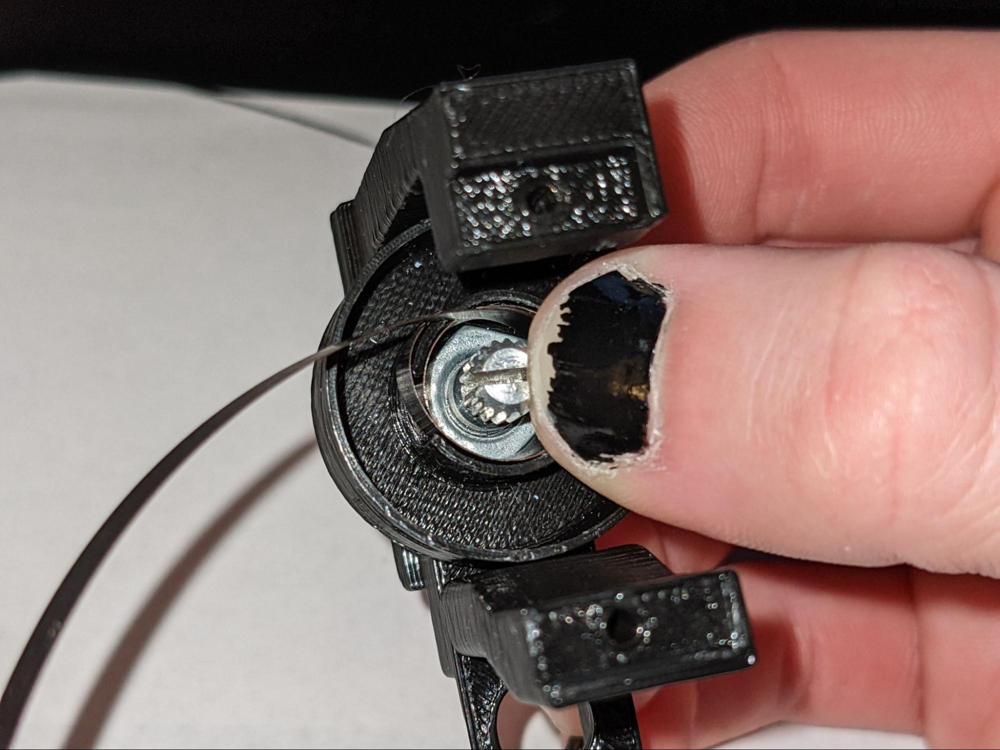
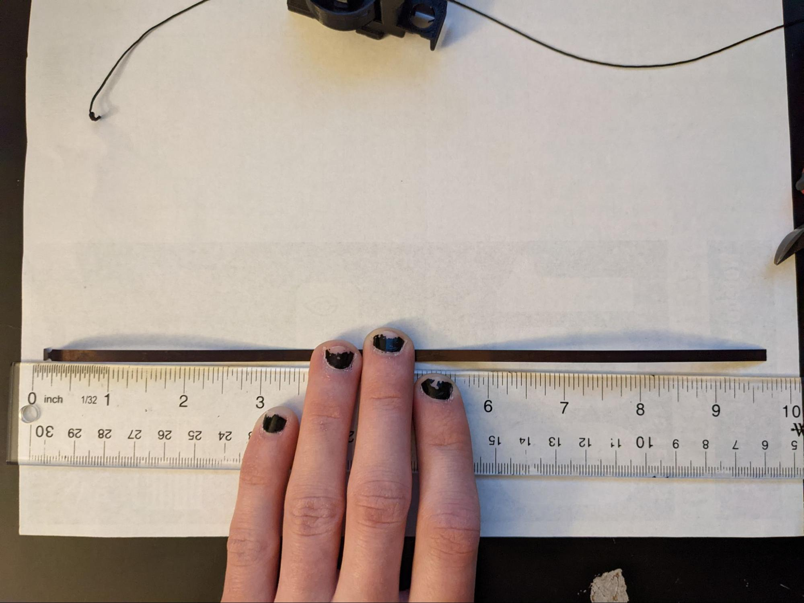
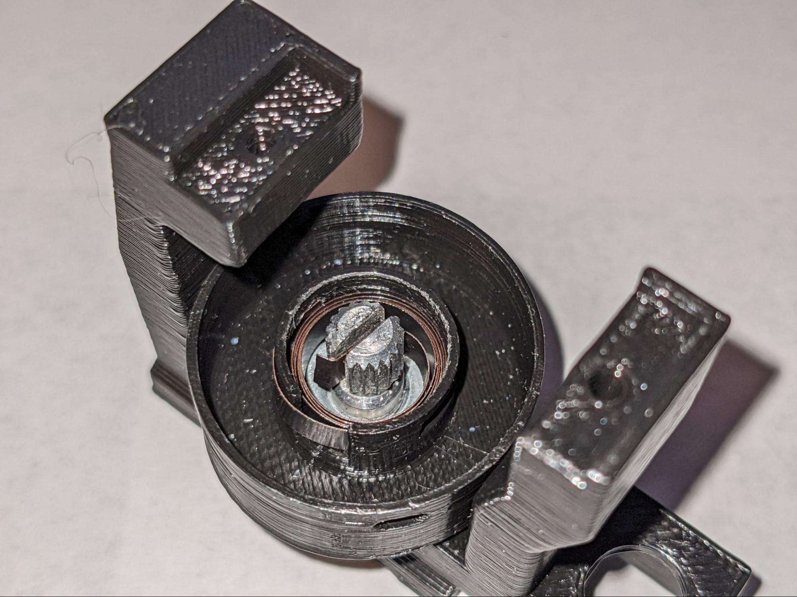
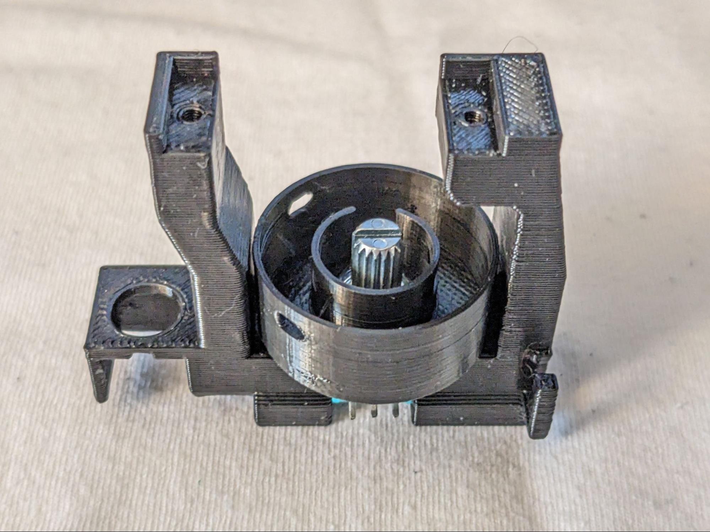

**Clear Gauntlets Mechanical Assembly Guide**

This guide details the full process of assembling the mechanical system for ClearGauntlets.  This process will require all the 3D printed components, all the potentiometers, and the badge reels.

Start assembly at the finger module level.  

Insert the first potentiometer into the center slot.  Put the nut in the spool 1 part.  It should be a tight fit.

Screw the spool 1 down onto the potentiometer.  We need the two holes to be aligned on either side of the front post.  Most often, they won’t be aligned initially.  At this point, take note of which way part of the post is facing the front of the module.

Use a sharpie to mark the corner of the hex nut which pointed to the front of the module

Remove the nut and reinster with the marked corner now oriented in between the two holes

Screw the spool 1 back onto the module base

Grab the spool 2 part and a badge reel

Cut the end of the badge reel string off

Use a pair of pliers or wire cutters to break open the badge reel, crushing the opening worked well on my badge reels

Extract the spring and the string from the badge reel.  You can throw the rest out.

Cut spring to a little under 10 inches, no need to be precise

Put a little bend in the cut end, it should only be maybe 2-3mm long, this will hold it in the potentiometer slot without slipping out.

Before winding the spring make sure the potentiometer is turned fully in one direction.

This should be clockwise if the module you are making is going to have the string coming out on the right side of the module. It will be counterclockwise if the string comes out on the left side.  This guide is showing a module where the string comes out to the right, iIf you are assembling a module where the string comes out on the left side, the direction of all winding in this guide should be reversed.

The modules where the string will come out to the right include Right Hand (RH) pointer, and middle, and LH ring, pinky, and thumb.

The modules where the string will come out to the left include RH ring, pinky, and thumb, and LH pointer and middle.

Starting with the flanged end, insert it through the sqaure hole on the left, you’ll need to come in at an angle.  You want the little divet to be passing through the square hole, the short end inside the inner area, and the rest of the spring coming out.

Start winding the spring counterclockwise, you’ll move it to the inner area right away, this motion should cause the flanged end to be pushed against the side wall as shown here.  As you are winding, you’ll also be guiding it down in line with the flanged end.  You’ll want to be holding it down with one thumb, while you use the other hand to move the free end.

The next three images show how I hold down the spooled spring, guide the free end around, and switch thumbs as I continue to guide in the free end of the spring.  Once you get the rhythm of it, it isn’t too difficult.

Once you reach the end of the spring, use a pair of needle nose pliers to grab the very end before the bend, curve it around a little more and place it in the slot of the potentiometer.  The spring might need to stretch a little bit in order to reach the slot, that’s okay and it will put a little tension on the potentiometer in it’s resting position, which is good.

It should look like this.

Use your pliers to push the spring down into place if needed.  We want it to be nice, neat, and all in line with itself, not coming up and down at different spots.

Thread the string though the hole in the upper spool.

Start winding to the right (clockwise if you look from below, counterclockwise if you look from above). Try to wind it fairly tight.

I like to just wind up until I can’t wind without stacking it on itself (usually 5 or so winds).  This will keep it flat against the spool.

Thread the string though the hole in the lower spool.

Bring the upper spool down into place, while keeping some tension on the end of the string.  Just shoving it in will cause the string to get all fucked up in there.

Keep tension as you push the upper spool down onto the potentiometer

Insert the other potentiometer, and tighten it into place with the hex nut

Position the potentiometer shaft so that it is halfway through its rotation range.  Than press the splay linkage onto the potentiometer shaft.

Assemble all of the modules in this fashion.

Now on to the larger assembly.

Cut two 12” strips of omni tape for each glove.  May be shorter or longer depending on hand size.

Fasten the straps to the outside edge of the baseplate as shown.  Either sew or glue this end to itself to create a tight anchor point for the straps.

Running the straps through the other slots on the baseplate, fasten the baseplate to the glove on your hand.  Find a position that feels comfortable on your hand and where you think the modules will be positioned in line with their respective fingers.  Once you find this potion, use a hot glue gun to glue the baseplate down to the glove in that position.  I prefer to be wearing the glove when I do this, so I can feel and adjust the position as I am gluing.  

Once that is dry, put the modules on the baseplate.  They slide on and then the retainers snap into the baseplate to keep them in place.

Find a comfortable position for the end of the splay node and glue it to the glove using hot glue.  You should be able to comfortably open/close your hand fully. You should also be able to splay your fingers with the linkage naturally following, this can be trickiest for the thumb.   It should also be generally around the first finger knuckle so it can guide the string at that point.  Do this for every finger.

Glue the finger rings onto each finger.  They should be past the last finger knuckle so the wide portion engages with the finger pad.  They shouldn’t be on the center of your finger pad as you still want to be able to feel and use your fingers.  The adjacent finger rings should naturally stagger with the lengths of your fingers, if they are even with each other then they may bump into each other which will be more noticeable when using the final product.

Next use a needle threading tool to thread the string from each module through the two holes on the splay node, and the lower hole on the finger ring.

Thread the string back through the top hole of the finger ring.

Pull the string taut and tie a double overhand knot at the finger ring.  Start by passing the end of the string under the thread running in between the splay node and finger ring.

Pass the end of the string through the loop created by the previous step.  Then pull tight.  Repeat to create a second knot on top.  Before pulling the knot tight, make sure the main line is tight.  The fingers on the glove should be in the  fully extended position, then pull the string coming out of the top hole on the finger ring right before tightening the knot.  This is important so that the string is the right length so that the zero position of the reel is at full extension.  You may need to adjust the tightness in this step.

